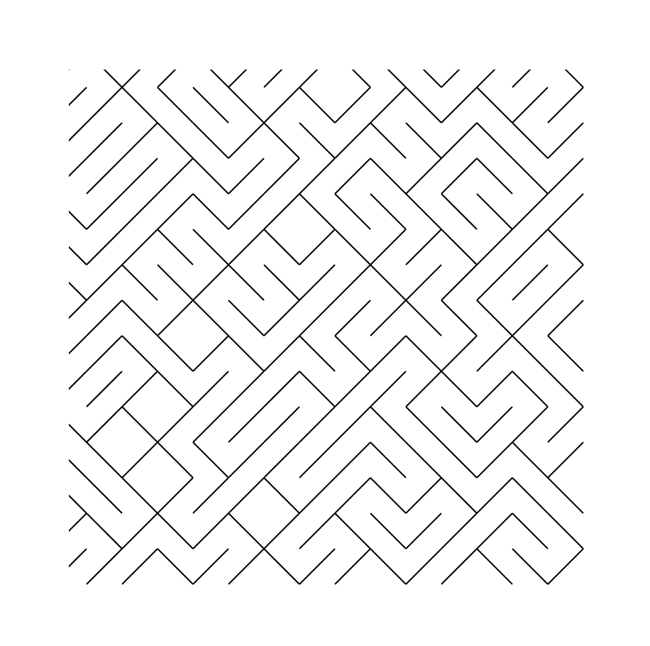

# Notes

* Unit segments are positioned on a grid
* They are rotated in one of two configurations
* They are scaled up

SVG does the heavy-lifting of transformations (translation, rotation, scaling).

## Lessons learned

Initially I thought I could somehow create segments from the grid coordinates. The biggest realization was that there is no need to compute segment starts and ends, since SVG can translate them.

## Ideas

* Make grid height and width distinct. I like how the square grid looks, though.
* Add in-page controls for adjusting the parameters (grid size, scale, line width, etc.)
* Play with colours. Try gradients. Try a random colour per segment.
